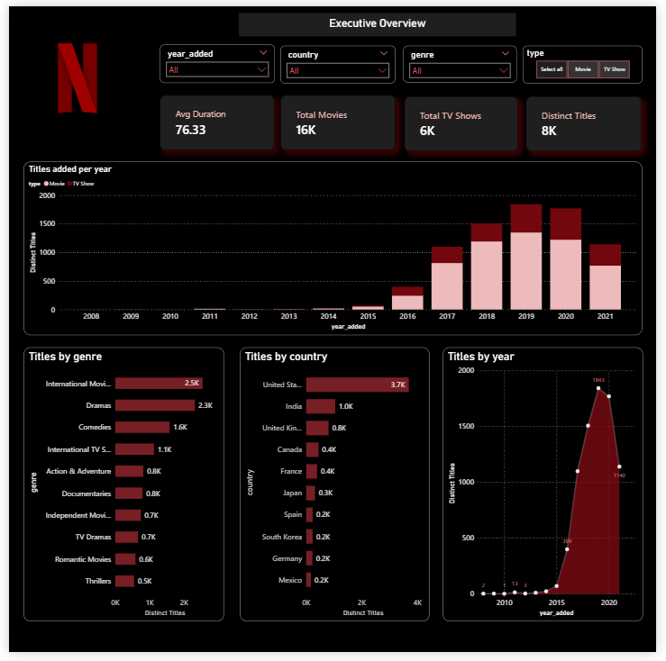
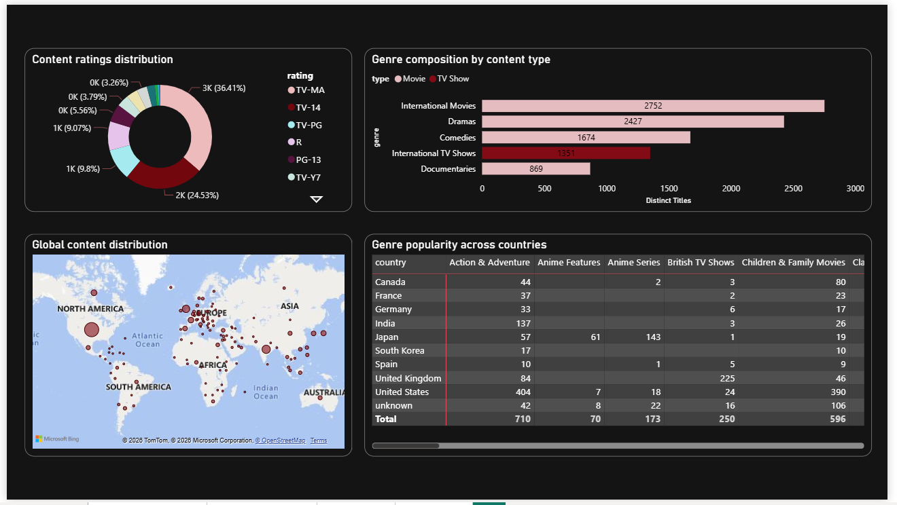

# Netflix Content Analytics Dashboard

## Project Overview
This project analyzes Netflix content data using SQL Server and Power BI. The dashboard provides insights into content growth trends, genre distribution, audience ratings, and geographic content distribution.

SQL was used for data cleaning, transformation, normalization, and exploratory analysis before connecting the final dataset to Power BI for visualization.

---

## Tools & Technologies
- SQL Server Management Studio (SSMS)
- SQL
- Power BI
- DAX
- GitHub

---

## Key Features
- KPI analysis for total titles, movies, TV shows, and average duration
- Trend analysis of Netflix content growth
- Genre-wise and country-wise distribution analysis
- Audience rating analysis
- Interactive slicers and filters
- Multi-page dashboard design

---

## Dashboard Pages

### Executive Overview
Provides high-level insights into:
- Content growth trends
- Movies vs TV Shows comparison
- Top genres on Netflix
- Top content-producing countries

### Content Insights
Provides deeper analysis into:
- Audience ratings distribution
- Genre composition by content type
- Geographic content distribution
- Genre popularity across countries

---

## Key Insights
- Netflix content additions increased significantly after 2016.
- Movies dominate Netflix’s content library.
- The United States and India contribute the highest number of titles.
- TV-MA and TV-14 are the most common audience ratings.

---

## Dashboard Screenshots

### Executive Overview
 

### Content Insights

